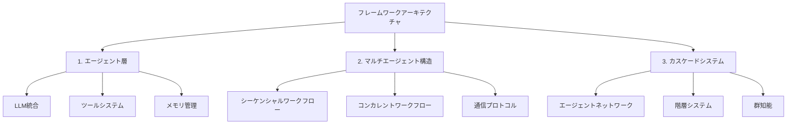

<div align="center">
  <a href="https://swarms.ai">
    
  </a>
</div>

<p align="center">
  <em>Rustで構築されたエンタープライズグレードの本番環境対応マルチエージェントオーケストレーションフレームワーク</em>
</p>

<p align="center">
  <!-- Rust Crate Badges -->
  <a href="https://crates.io/crates/swarms-rs" target="_blank">
    
    
    
  </a>
</p>

<p align="center">
    <a href="https://twitter.com/swarms_corp/">🐦 Twitter</a>
    <span>&nbsp;&nbsp;•&nbsp;&nbsp;</span>
    <a href="https://discord.gg/EamjgSaEQf">📢 Discord</a>
    <span>&nbsp;&nbsp;•&nbsp;&nbsp;</span>
    <a href="https://swarms.ai">Swarms Website</a>
    <span>&nbsp;&nbsp;•&nbsp;&nbsp;</span>
    <a href="https://docs.swarms.world">📙 ドキュメント</a>
    <span>&nbsp;&nbsp;•&nbsp;&nbsp;</span>
    <a href="https://swarms.world">Swarms Marketplace</a>
</p>

<p align="center">
    <!-- Social Media -->
    <a href="https://discord.gg/jHnrkH5y">
        
    </a>
    <a href="https://www.youtube.com/@kyegomez3242">
        
    </a>
    <a href="https://www.linkedin.com/in/kye-g-38759a207/">
        
    </a>
    <a href="https://x.com/kyegomezb">
        
    </a>
</p>

## 概要

`swarms-rs`は、Rustで構築されたエンタープライズグレードの本番環境対応マルチエージェントオーケストレーションフレームワークです。Rustの最先端のパフォーマンスと安全性機能を活用し、最も要求の厳しいタスクを前例のない速度と効率で処理するように設計されています。

## 🌐 対応言語

- [English](README.md)
- [日本語](README.ja.md)
- [中文](README.zh.md)

## 主な利点

| 機能 | 説明 |
|------|------|
| 極限のパフォーマンス | Rustのゼロコスト抽象化と恐れない並行性により、最新のマルチコアプロセッサの可能性を最大限に活用します。`Swarms-rs`は、エージェントが最小限のオーバーヘッドで実行され、最大のスループットと効率を達成することを保証します。 |
| 最先端の速度 | Rustで書かれた`swarms-rs`は、ほぼゼロの遅延と稲妻のような高速実行を提供し、高頻度およびリアルタイムアプリケーションに最適な選択肢となります。 |
| エンタープライズグレードの信頼性 | Rustの所有権モデルは、ガベージコレクタを必要とせずにメモリ安全性を保証し、マルチエージェントシステムがデータ競合やメモリリークから解放されることを保証します。 |
| 本番環境対応 | 実世界の展開のために設計された`swarms-rs`は、堅牢性と信頼性を備えており、ミッションクリティカルなタスクを処理する準備ができています。 |
| 強力なオーケストレーション | 数千のエージェントをシームレスに管理・調整し、効率的にコミュニケーションと協力を行い、複雑な目標を達成できるようにします。 |
| 拡張性とモジュール性 | `Swarms-rs`は高度にモジュール化されており、開発者が特定のユースケースに合わせてフレームワークを簡単に拡張・カスタマイズできます。 |
| スケーラブルで効率的 | 少数のエージェントをオーケストレーションする場合でも、数百万にスケールアップする場合でも、`swarms-rs`はニーズに合わせて成長するように設計されており、あらゆるレベルで最高のパフォーマンスを維持します。 |
| リソース効率 | Rustのメモリと処理能力に対するきめ細かい制御により、システムリソースの使用を最大化し、重い負荷下でもエージェントが最適に実行されることを保証します。 |

## はじめに

### 前提条件

- Rust（最新の安定版を推奨）
- Cargoパッケージマネージャー
- LLMプロバイダーのAPIキー（OpenAI、DeepSeekなど）

### インストール

`Cargo.toml`に`swarms-rs`を追加します：

```toml
[dependencies]
swarms-rs = "*"

# またはGitHubから最新バージョンを使用
# swarms-rs = { git = "https://github.com/The-Swarm-Corporation/swarms-rs", branch = "main" }
```

### 環境設定

プロジェクトのルートに`.env`ファイルを作成し、API認証情報を設定します：

```
OPENAI_API_KEY=your_openai_key_here
OPENAI_BASE_URL=https://api.openai.com/v1

# DeepSeekの場合
DEEPSEEK_API_KEY=your_deepseek_key_here
DEEPSEEK_BASE_URL=https://api.deepseek.com/v1
```

## フレームワークアーキテクチャ

swarms-rsでは、フレームワークを3つの主要なアーキテクチャ段階にモジュール化し、それぞれが前の段階を基盤として、ますます洗練されたエージェントシステムを作成します：



1. **エージェント（LLM + ツール + メモリ）**
   - **言語モデル**: 様々なLLMプロバイダーとの統合（OpenAI、DeepSeekなど）
   - **ツールシステム**: MCPとカスタムツールを通じて機能を追加するための拡張可能なフレームワーク
   - **メモリ管理**: コンテキストを維持するための短期および長期メモリシステム
   - **状態管理**: エージェントの状態、設定、およびランタイムパラメータの処理

2. **マルチエージェント構造と通信**
   - **シーケンシャルワークフロー**: 複数のエージェント間のタスクの線形進行
   - **コンカレントワークフロー**: 複数のエージェント間でのタスクの並列実行
   - **通信プロトコル**: エージェント間通信の標準化された方法
   - **タスク配分**: エージェントネットワーク全体でのワークロードのインテリジェントな配分
   - **同期**: エージェントの活動と結果の共有を調整するメカニズム

3. **カスケードマルチエージェントシステム**
   - **階層組織**: 専門的な役割を持つマルチレベルエージェント構造
   - **群知能**: 大規模なエージェント相互作用からの創発的動作
   - **動的スケーリング**: ワークロードに基づいてエージェントネットワークをスケーリングする能力
   - **フォールトトレランス**: 堅牢なエラー処理とシステム回復
   - **リソース最適化**: システムリソースの効率的な割り当てと利用

このモジュール化されたアーキテクチャにより、単純な単一エージェントアプリケーションから複雑な分散マルチエージェントシステムまで、柔軟な展開シナリオが可能になります。各層は拡張可能に設計されており、開発者がフレームワークのエンタープライズグレードの信頼性とパフォーマンスの利点を維持しながら、機能をカスタマイズおよび強化できます。

## エージェント

エージェントは、ツールとメモリを備えたLLMによって駆動されるエンティティで、問題を自動化するために自律的に実行できます。以下は例です：

```rust
use std::env;

use anyhow::Result;
use swarms_rs::{llm::provider::openai::OpenAI, structs::agent::Agent};
use tracing_subscriber::{layer::SubscriberExt, util::SubscriberInitExt};

#[tokio::main]
async fn main() -> Result<()> {
    dotenv::dotenv().ok();
    tracing_subscriber::registry()
        .with(tracing_subscriber::EnvFilter::from_default_env())
        .with(
            tracing_subscriber::fmt::layer()
                .with_line_number(true)
                .with_file(true),
        )
        .init();

    let base_url = env::var("DEEPSEEK_BASE_URL").unwrap();
    let api_key = env::var("DEEPSEEK_API_KEY").unwrap();
    let client = OpenAI::from_url(base_url, api_key).set_model("deepseek-chat");
    let agent = client
        .agent_builder()
        .system_prompt(
            "あなたは高度な暗号通貨分析アシスタントで、以下の専門分野を持っています：
            1. 暗号通貨市場のテクニカル分析
            2. ブロックチェーンプロジェクトのファンダメンタル分析
            3. 市場センチメント分析
            4. リスク評価
            5. 取引パターン認識
            
            暗号通貨を分析する際は、常に以下を考慮してください：
            - 時価総額と取引量
            - 過去の価格トレンド
            - プロジェクトのファンダメンタルズと技術
            - 最近のニュースと開発状況
            - 市場センチメント指標
            - 潜在的なリスクと機会
            
            明確でデータに基づいた洞察を提供し、市場の変動性に関する関連する免責事項を常に含めてください。"
        )
        .agent_name("CryptoAnalyst")
        .user_name("Trader")
        .enable_autosave()
        .max_loops(3)  // より徹底的な分析のために増加
        .save_state_dir("./crypto_analysis/")
        .enable_plan("暗号通貨分析を体系的なステップに分解します：
            1. 市場データの収集
            2. テクニカル指標の分析
            3. ファンダメンタル要因のレビュー
            4. 市場センチメントの評価
            5. 包括的な洞察の提供".to_owned())
        .build();
    let response = agent
        .run("人生の意味は何ですか？".to_owned())
        .await
        .unwrap();
    println!("{response}");
    Ok(())
}
```

### MCPツールサポート

`swarms-rs`はModel Context Protocol（MCP）をサポートしており、エージェントが標準化されたインターフェースを通じて外部ツールと対話できるようにします。この強力な機能により、エージェントは言語能力を超えて現実世界のデータにアクセスし、アクションを実行できます。

### サポートされているMCPサーバータイプ

- **STDIO MCPサーバー**: MCPプロトコルを実装するコマンドラインツールに接続
- **SSE MCPサーバー**: Server-Sent Eventsを使用してWebベースのMCPサーバーに接続

### 使用例

```rust
// STDIO MCPサーバーを追加
.add_stdio_mcp_server("uvx", ["mcp-hn"])
.await

// SSE MCPサーバーを追加
.add_sse_mcp_server("example-sse-mcp-server", "http://127.0.0.1:8000/sse")
.await
```

### 完全なMCPエージェントの例

```rust
use std::env;

use anyhow::Result;
use swarms_rs::{llm::provider::openai::OpenAI, structs::agent::Agent};
use tracing_subscriber::{layer::SubscriberExt, util::SubscriberInitExt};

#[tokio::main]
async fn main() -> Result<()> {
    dotenv::dotenv().ok();
    tracing_subscriber::registry()
        .with(tracing_subscriber::EnvFilter::from_default_env())
        .with(
            tracing_subscriber::fmt::layer()
                .with_line_number(true)
                .with_file(true),
        )
        .init();

    let base_url = env::var("DEEPSEEK_BASE_URL").unwrap();
    let api_key = env::var("DEEPSEEK_API_KEY").unwrap();
    let client = OpenAI::from_url(base_url, api_key).set_model("deepseek-chat");
    let agent = client
        .agent_builder()
        .system_prompt("あなたは役立つアシスタントです。")
        .agent_name("SwarmsAgent")
        .user_name("User")
        // uvのインストール方法: https://github.com/astral-sh/uv#installation
        // mcp stdioサーバー、他のstdio mcpサーバーも使用可能
        .add_stdio_mcp_server("uvx", ["mcp-hn"])
        .await
        // mcp sseサーバー、mcp-proxyを使用してstdio mcpサーバー（sseモードをサポートしていない）をsseサーバーにプロキシできます
        // コンソールで実行: uvx mcp-proxy --sse-port=8000 -- npx -y @modelcontextprotocol/server-filesystem ~
        // これにより、ポート8000でsseサーバーが起動し、~がアクセス可能な唯一のディレクトリになります
        .add_sse_mcp_server("example-sse-mcp-server", "http://127.0.0.1:8000/sse")
        .await
        .retry_attempts(1)
        .max_loops(1)
        .build();

    let response = agent
        .run("今日のトップ3ストーリーを取得".to_owned())
        .await
        .unwrap();
    // mcp-hn stdioサーバーが呼び出され、レスポンスを提供
    println!("STDIO MCP RESPONSE:\n{response}");

    let response = agent.run("~ディレクトリをリスト".to_owned()).await.unwrap();
    // example-sse-mcp-serverが呼び出され、レスポンスを提供
    println!("SSE MCP RESPONSE:\n{response}");

    Ok(())
}
```

[mcp_tool.rs](swarms-rs/examples/mcp_tool.rs)の例を参照して、完全な実装を確認してください。

## マルチエージェントアーキテクチャ

### ConcurrentWorkflow

これは`ConcurrentWorkflow`を使用して複数のエージェントを同時に実行する例です：

```rust
use std::env;

use anyhow::Result;
use swarms_rs::llm::provider::openai::OpenAI;
use swarms_rs::structs::concurrent_workflow::ConcurrentWorkflow;

#[tokio::main]
async fn main() -> Result<()> {
    dotenv::dotenv().ok();

    let subscriber = tracing_subscriber::fmt::Subscriber::builder()
        .with_env_filter(tracing_subscriber::EnvFilter::from_default_env())
        .with_line_number(true)
        .with_file(true)
        .finish();
    tracing::subscriber::set_global_default(subscriber)?;

    let base_url = env::var("DEEPSEEK_BASE_URL").unwrap();
    let api_key = env::var("DEEPSEEK_API_KEY").unwrap();
    let client = OpenAI::from_url(base_url, api_key).set_model("deepseek-chat");

    // 独立した役割を持つ専門的な取引エージェントを作成
    let market_analysis_agent = client
        .agent_builder()
        .agent_name("市場分析エージェント")
        .system_prompt(
            "あなたは取引のための市場分析スペシャリストです。提供された市場データを分析し、\
       主要なトレンド、パターン、テクニカル指標を特定します。あなたのタスクは、\
       サポート/レジスタンスレベル、出来高分析、全体的な市場センチメントを含む\
       包括的な市場分析を提供することです。特定の取引推奨を行わずに、\
       現在の市場状況のみを分析することに焦点を当ててください。\
       分析は<DONE>で終了します。",
        )
        .user_name("Trader")
        .max_loops(1)
        .temperature(0.2) // 正確なテクニカル分析のための低い温度
        .enable_autosave()
        .save_state_dir("./temp/concurrent_workflow/trading")
        .add_stop_word("<DONE>")
        .build();

    let trade_strategy_agent = client
        .agent_builder()
        .agent_name("取引戦略エージェント")
        .system_prompt(
            "あなたは取引戦略スペシャリストです。提供された市場シナリオに基づいて、\
       包括的な取引戦略を開発します。あなたのタスクは、与えられた市場情報を分析し、\
       潜在的なエントリーポイントとイグジットポイント、ポジションサイジングの推奨、\
       および注文タイプを含む戦略を作成することです。リスク評価を行わずに、\
       戦略開発のみに焦点を当ててください。戦略は<DONE>で終了します。",
        )
        .user_name("Trader")
        .max_loops(1)
        .temperature(0.3)
        .enable_autosave()
        .save_state_dir("./temp/concurrent_workflow/trading")
        .add_stop_word("<DONE>")
        .build();

    let risk_assessment_agent = client
        .agent_builder()
        .agent_name("リスク評価エージェント")
        .system_prompt(
            "あなたは取引のためのリスク評価スペシャリストです。あなたの役割は、\
       提供された市場シナリオの潜在的なリスクを評価することです。\
       ボラティリティ、最大ドローダウン、リスクリワード比率などの\
       適切なリスク指標を、提供された市場情報のみに基づいて計算します。\
       特定の取引戦略を考慮せずに、独立したリスク評価を提供してください。\
       評価は<DONE>で終了します。",
        )
        .user_name("Trader")
        .max_loops(1)
        .temperature(0.2)
        .enable_autosave()
        .save_state_dir("./temp/concurrent_workflow/trading")
        .add_stop_word("<DONE>")
        .build();

    // すべての取引エージェントを含むコンカレントワークフローを作成
    let workflow = ConcurrentWorkflow::builder()
        .name("取引戦略ワークフロー")
        .metadata_output_dir("./temp/concurrent_workflow/trading/workflow/metadata")
        .description("独立した専門エージェントによる市場データ分析のためのワークフロー。")
        .agents(vec![
            Box::new(market_analysis_agent),
            Box::new(trade_strategy_agent),
            Box::new(risk_assessment_agent),
        ])
        .build();

    let result = workflow
        .run(
            "BTC/USDは$50,000の主要なレジスタンスレベルに近づいており、\
             出来高が増加しています。RSIは68で、MACDは強気の勢いを示しています。\
             ブレイクアウトシナリオのための取引戦略を開発してください。",
        )
        .await?;

    println!("{}", serde_json::to_string_pretty(&result)?);
    Ok(())
}
```

## サンプルコードの実行

[swarms-rs/examples](swarms-rs/examples/)には、かなりの程度の参考となるサンプルコードがあります：

グラフワークフローの例を実行するには：

```bash
cargo run --example graph_workflow
```

`DEEPSEEK_API_KEY`と`DEEPSEEK_BASE_URL`環境変数はデフォルトで読み込まれます。

## アーキテクチャ

`swarms-rs`は、簡単な拡張とカスタマイズを可能にするモジュール化されたアーキテクチャで構築されています：

- **エージェント層**: メモリ管理とツール統合を備えたコアエージェント実装
- **LLMプロバイダー層**: 異なるLLMプロバイダー（OpenAI、DeepSeekなど）の抽象化
- **ツールシステム**: エージェントに機能を追加するための拡張可能なツールフレームワーク
- **MCP統合**: STDIOおよびSSEインターフェースを介したModel Context Protocolツールのサポート
- **スウォームオーケストレーション**: 複雑なワークフローのための複数のエージェントの調整
- **永続化層**: 状態管理と回復メカニズム

### 開発環境のセットアップ

1. リポジトリをクローン：

   ```bash
   git clone https://github.com/The-Swarm-Corporation/swarms-rs
   cd swarms-rs
   ```

2. 開発依存関係をインストール：

   ```bash
   cargo install cargo-nextest
   ```

3. テストを実行：

   ```bash
   cargo nextest run
   ```

4. ベンチマークを実行：

   ```bash
   cargo bench
   ```

## ライセンス

このプロジェクトはMITライセンスの下でライセンスされています - 詳細は[LICENSE](LICENSE)ファイルを参照してください。

## 連絡先

質問、提案、またはフィードバックについては、イシューを開くか、[kye@swarms.world](mailto:kye@swarms.world)までご連絡ください。 