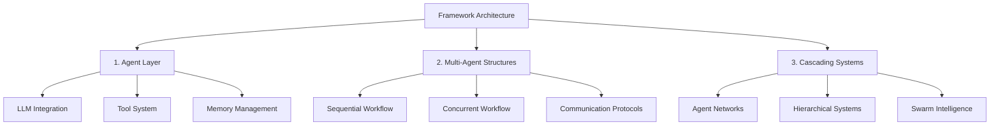

<div align="center">
  <a href="https://swarms.ai">
    
  </a>
</div>

<p align="center">
  <em>The Enterprise-Grade Production-Ready Multi-Agent Orchestration Framework in Rust</em>
</p>

<p align="center">
  <!-- Rust Crate Badges -->
  <a href="https://crates.io/crates/swarms-rs" target="_blank">
    
    
    
  </a>
</p>

<p align="center">
    <a href="https://twitter.com/swarms_corp/">
        
    </a>
    <a href="https://discord.gg/EamjgSaEQf">
        
    </a>
    <a href="https://swarms.ai">
        
    </a>
    <a href="https://docs.swarms.world">
        
    </a>
    <a href="https://swarms.world">
        
    </a>
</p>

<p align="center">
    <!-- Project Stats for swarms-rs -->
    <a href="https://github.com/The-Swarm-Corporation/swarms-rs/issues">
        
    </a>
    <a href="https://github.com/The-Swarm-Corporation/swarms-rs/network">
        
    </a>
    <a href="https://github.com/The-Swarm-Corporation/swarms-rs/stargazers">
        
    </a>
    <a href="https://github.com/The-Swarm-Corporation/swarms-rs/blob/main/LICENSE">
        
    </a>
</p>


## Overview

`swarms-rs` is the first-ever enterprise-grade, production-ready multi-agent orchestration framework built in Rust, designed to handle the most demanding tasks with unparalleled speed and efficiency. By leveraging Rust's cutting-edge performance and safety features, `swarms-rs` provides a powerful and scalable solution for orchestrating complex multi-agent systems across various industries.


## 🌐 Available Languages

- [English](README.md)
- [中文](docs/README.zh.md)
- [日本語](docs/README.ja.md)

## Key Benefits

| Feature                        | Description                                                                                                                                                                                                 |
|--------------------------------|-------------------------------------------------------------------------------------------------------------------------------------------------------------------------------------------------------------|
| Extreme Performance            | Utilize the full potential of modern multi-core processors with Rust's zero-cost abstractions and fearless concurrency. `Swarms-rs` ensures that your agents run with minimal overhead, achieving maximum throughput and efficiency. |
| Bleeding-Edge Speed            | Written in Rust, `swarms-rs` delivers near-zero latency and lightning-fast execution, making it the ideal choice for high-frequency and real-time applications.                                              |
| Enterprise-Grade Reliability    | Rust's ownership model guarantees memory safety without the need for a garbage collector, ensuring that your multi-agent systems are free from data races and memory leaks.                                   |
| Production-Ready               | Designed for real-world deployment, `swarms-rs` is ready to handle mission-critical tasks with robustness and reliability that you can depend on.                                                           |
| Powerful Orchestration         | Seamlessly manage and coordinate thousands of agents, allowing them to communicate and collaborate efficiently to achieve complex goals.                                                                     |
| Extensible and Modular         | `Swarms-rs` is highly modular, allowing developers to easily extend and customize the framework to suit specific use cases.                                                                                 |
| Scalable and Efficient         | Whether you're orchestrating a handful of agents or scaling up to millions, `swarms-rs` is designed to grow with your needs, maintaining top-tier performance at every level.                               |
| Resource Efficiency             | Maximize the use of system resources with Rust's fine-grained control over memory and processing power, ensuring that your agents run optimally even under heavy loads.                                      |

## Getting Started

### Prerequisites

- Rust (latest stable version recommended)
- Cargo package manager
- An API key for your LLM provider (OpenAI, DeepSeek, Anthropic etc.)


----------

### Installation

```bash
# Add the latest version to your project
cargo add swarms-rs
```


-------

### Environment Setup

Create a `.env` file in your project root with your API credentials:

```
OPENAI_API_KEY=your_openai_key_here
OPENAI_BASE_URL=https://api.openai.com/v1

# Or for DeepSeek
DEEPSEEK_API_KEY=your_deepseek_key_here
DEEPSEEK_BASE_URL=https://api.deepseek.com/v1
```

------------


## Quickstart


### Agents

An agent is an entity powered by an LLM equipped with tools and memory that can run autonomously to automate issues. Here's an example:

```rust
use std::env;

use anyhow::Result;
use swarms_rs::{llm::provider::openai::OpenAI, structs::agent::Agent};
use tracing_subscriber::{layer::SubscriberExt, util::SubscriberInitExt};

#[tokio::main]
async fn main() -> Result<()> {
    dotenv::dotenv().ok();
    tracing_subscriber::registry()
        .with(tracing_subscriber::EnvFilter::from_default_env())
        .with(
            tracing_subscriber::fmt::layer()
                .with_line_number(true)
                .with_file(true),
        )
        .init();

    let base_url = env::var("DEEPSEEK_BASE_URL").unwrap();
    let api_key = env::var("DEEPSEEK_API_KEY").unwrap();
        let client = OpenAI::from_url(base_url, api_key).set_model("deepseek-chat");
    let agent = client
        .agent_builder()
        .system_prompt(
            "You are a sophisticated cryptocurrency analysis assistant specialized in:
            1. Technical analysis of crypto markets
            2. Fundamental analysis of blockchain projects
            3. Market sentiment analysis
            4. Risk assessment
            5. Trading patterns recognition
            
            When analyzing cryptocurrencies, always consider:
            - Market capitalization and volume
            - Historical price trends
            - Project fundamentals and technology
            - Recent news and developments
            - Market sentiment indicators
            - Potential risks and opportunities
            
            Provide clear, data-driven insights and always include relevant disclaimers about market volatility."
        )
        .agent_name("CryptoAnalyst")
        .user_name("Trader")
        .enable_autosave()
        .max_loops(3)  // Increased to allow for more thorough analysis
        .save_state_dir("./crypto_analysis/")
        .enable_plan("Break down the crypto analysis into systematic steps:
            1. Gather market data
            2. Analyze technical indicators
            3. Review fundamental factors
            4. Assess market sentiment
            5. Provide comprehensive insights".to_owned())
        .build();
    let response = agent
        .run("What is the meaning of life?".to_owned())
        .await
        .unwrap();
    println!("{response}");
    Ok(())
}

```

--------

### MCP Tool Support

`swarms-rs` supports the Model Context Protocol (MCP), enabling agents to interact with external tools through standardized interfaces. This powerful feature allows your agents to access real-world data and perform actions beyond their language capabilities.

### Supported MCP Server Types

- **STDIO MCP Servers**: Connect to command-line tools that implement the MCP protocol
- **SSE MCP Servers**: Connect to web-based MCP servers using Server-Sent Events

### Example Usage

```rust
// Add a STDIO MCP server
.add_stdio_mcp_server("uvx", ["mcp-hn"])
.await

// Add an SSE MCP server
.add_sse_mcp_server("example-sse-mcp-server", "http://127.0.0.1:8000/sse")
.await
```

----

### Full MCP Agent Example

```rust
use std::env;

use anyhow::Result;
use swarms_rs::{llm::provider::openai::OpenAI, structs::agent::Agent};
use tracing_subscriber::{layer::SubscriberExt, util::SubscriberInitExt};

#[tokio::main]
async fn main() -> Result<()> {
    dotenv::dotenv().ok();
    tracing_subscriber::registry()
        .with(tracing_subscriber::EnvFilter::from_default_env())
        .with(
            tracing_subscriber::fmt::layer()
                .with_line_number(true)
                .with_file(true),
        )
        .init();

    let base_url = env::var("DEEPSEEK_BASE_URL").unwrap();
    let api_key = env::var("DEEPSEEK_API_KEY").unwrap();
    let client = OpenAI::from_url(base_url, api_key).set_model("deepseek-chat");
    let agent = client
        .agent_builder()
        .system_prompt("You are a helpful assistant.")
        .agent_name("SwarmsAgent")
        .user_name("User")
        // How to install uv: https://github.com/astral-sh/uv#installation
        // mcp stdio server, any other stdio mcp server can be used
        .add_stdio_mcp_server("uvx", ["mcp-hn"])
        .await
        // mcp sse server, we can use mcp-proxy to proxy the stdio mcp server(which does not support sse mode) to sse server
        // run in console: uvx mcp-proxy --sse-port=8000 -- npx -y @modelcontextprotocol/server-filesystem ~
        // this will start a sse server on port 8000, and ~ will be the only allowed directory to access
        .add_sse_mcp_server("example-sse-mcp-server", "http://127.0.0.1:8000/sse")
        .await
        .retry_attempts(1)
        .max_loops(1)
        .build();

    let response = agent
        .run("Get the top 3 stories of today".to_owned())
        .await
        .unwrap();
    // mcp-hn stdio server is called and give us the response
    println!("STDIO MCP RESPONSE:\n{response}");

    let response = agent.run("List ~ directory".to_owned()).await.unwrap();
    // example-sse-mcp-server is called and give us the response
    println!("SSE MCP RESPONSE:\n{response}");

    Ok(())
}
```


See the [mcp_tool.rs](swarms-rs/examples/mcp_tool.rs) example for a complete implementation.

-----------


## Multi-Agent Architectures

### ConcurrentWorkflow

This is an example of utilizing the `ConcurrentWorkflow` to concurrently execute multiple agents at the same time


```rust
use std::env;

use anyhow::Result;
use swarms_rs::llm::provider::openai::OpenAI;
use swarms_rs::structs::concurrent_workflow::ConcurrentWorkflow;

#[tokio::main]
async fn main() -> Result<()> {
    dotenv::dotenv().ok();

    let subscriber = tracing_subscriber::fmt::Subscriber::builder()
        .with_env_filter(tracing_subscriber::EnvFilter::from_default_env())
        .with_line_number(true)
        .with_file(true)
        .finish();
    tracing::subscriber::set_global_default(subscriber)?;

    let base_url = env::var("DEEPSEEK_BASE_URL").unwrap();
    let api_key = env::var("DEEPSEEK_API_KEY").unwrap();
    let client = OpenAI::from_url(base_url, api_key).set_model("deepseek-chat");

    // Create specialized trading agents with independent roles
    let market_analysis_agent = client
        .agent_builder()
        .agent_name("Market Analysis Agent")
        .system_prompt(
            "You are a market analysis specialist for trading. Analyze the provided market data \
       and identify key trends, patterns, and technical indicators. Your task is to provide \
       a comprehensive market analysis including support/resistance levels, volume analysis, \
       and overall market sentiment. Focus only on analyzing current market conditions \
       without making specific trading recommendations. End your analysis with <DONE>.",
        )
        .user_name("Trader")
        .max_loops(1)
        .temperature(0.2) // Lower temperature for precise technical analysis
        .enable_autosave()
        .save_state_dir("./temp/concurrent_workflow/trading")
        .add_stop_word("<DONE>")
        .build();

    let trade_strategy_agent = client
        .agent_builder()
        .agent_name("Trade Strategy Agent")
        .system_prompt(
            "You are a trading strategy specialist. Based on the provided market scenario, \
       develop a comprehensive trading strategy. Your task is to analyze the given market \
       information and create a strategy that includes potential entry and exit points, \
       position sizing recommendations, and order types. Focus solely on strategy development \
       without performing risk assessment. End your strategy with <DONE>.",
        )
        .user_name("Trader")
        .max_loops(1)
        .temperature(0.3)
        .enable_autosave()
        .save_state_dir("./temp/concurrent_workflow/trading")
        .add_stop_word("<DONE>")
        .build();

    let risk_assessment_agent = client
        .agent_builder()
        .agent_name("Risk Assessment Agent")
        .system_prompt(
            "You are a risk assessment specialist for trading. Your role is to evaluate \
       potential risks in the provided market scenario. Calculate appropriate risk metrics \
       such as volatility, maximum drawdown, and risk-reward ratios based solely on the \
       market information provided. Provide an independent risk assessment without \
       considering specific trading strategies. End your assessment with <DONE>.",
        )
        .user_name("Trader")
        .max_loops(1)
        .temperature(0.2)
        .enable_autosave()
        .save_state_dir("./temp/concurrent_workflow/trading")
        .add_stop_word("<DONE>")
        .build();

    // Create a concurrent workflow with all trading agents
    let workflow = ConcurrentWorkflow::builder()
        .name("Trading Strategy Workflow")
        .metadata_output_dir("./temp/concurrent_workflow/trading/workflow/metadata")
        .description("A workflow for analyzing market data with independent specialized agents.")
        .agents(vec![
            Box::new(market_analysis_agent),
            Box::new(trade_strategy_agent),
            Box::new(risk_assessment_agent),
        ])
        .build();

    let result = workflow
        .run(
            "BTC/USD is approaching a key resistance level at $50,000 with increasing volume. \
             RSI is at 68 and MACD shows bullish momentum. Develop a trading strategy for a \
             potential breakout scenario.",
        )
        .await?;

    println!("{}", serde_json::to_string_pretty(&result)?);
    Ok(())
}
```


-----------


## Run Examples

In [swarms-rs/examples](swarms-rs/examples/) there is our sample code, which can provide a considerable degree of reference:

To run the graph workflow example:

```bash
cargo run --example graph_workflow
```

`DEEPSEEK_API_KEY` and `DEEPSEEK_BASE_URL` environment variables are read by default.

----


## Framework Architecture

In swarms-rs, we modularize the framework into three primary architectural stages, each building upon the previous to create increasingly sophisticated agent systems:




# Features

| **Agents (LLM + Tools + Memory)** |                                                                                                 |
|-----------------------------------|-------------------------------------------------------------------------------------------------|
| **Language Models**               | Integration with various LLM providers (OpenAI, DeepSeek, etc.)                                 |
| **Tool System**                   | Extensible framework for adding capabilities through MCP and custom tools                       |
| **Memory Management**             | Short-term and long-term memory systems for maintaining context                                 |
| **State Management**              | Handling agent state, configuration, and runtime parameters                                     |

| **Multi-Agent Structures and Communication** |                                                                                      |
|----------------------------------------------|--------------------------------------------------------------------------------------|
| **Sequential Workflows**                     | Linear progression of tasks between multiple agents                                   |
| **Concurrent Workflows**                     | Parallel execution of tasks across multiple agents                                    |
| **Communication Protocols**                  | Standardized methods for inter-agent communication                                    |
| **Task Distribution**                        | Intelligent distribution of workload across agent networks                            |
| **Synchronization**                          | Mechanisms for coordinating agent activities and sharing results                      |

| **Cascading Multi-Agent Systems** |                                                                                          |
|-----------------------------------|------------------------------------------------------------------------------------------|
| **Hierarchical Organizations**    | Multi-level agent structures with specialized roles                                      |
| **Swarm Intelligence**            | Emergent behavior from large-scale agent interactions                                    |
| **Dynamic Scaling**               | Ability to scale agent networks based on workload                                        |
| **Fault Tolerance**               | Robust error handling and system recovery                                                |
| **Resource Optimization**         | Efficient allocation and utilization of system resources                                 |

This modular architecture allows for flexible deployment scenarios, from simple single-agent applications to complex, distributed multi-agent systems. Each layer is designed to be extensible, allowing developers to customize and enhance functionality while maintaining the core benefits of the framework's enterprise-grade reliability and performance.


## Architecture

`swarms-rs` is built with a modular architecture that allows for easy extension and customization:

| Layer/Component         | Description                                                                                      |
|------------------------|--------------------------------------------------------------------------------------------------|
| **Agent Layer**        | Core agent implementation with memory management and tool integration                            |
| **LLM Provider Layer** | Abstraction for different LLM providers (OpenAI, DeepSeek, etc.)                                 |
| **Tool System**        | Extensible tool framework for adding capabilities to agents                                       |
| **MCP Integration**    | Support for Model Context Protocol tools via STDIO and SSE interfaces                            |
| **Swarm Orchestration**| Coordination of multiple agents for complex workflows                                            |
| **Persistence Layer**  | State management and recovery mechanisms                                                         |

---------


### Development Setup

1. Clone the repository:

   ```bash
   git clone https://github.com/The-Swarm-Corporation/swarms-rs
   cd swarms-rs
   ```

2. Install development dependencies:

   ```bash
   cargo install cargo-nextest
   ```

3. Run tests:

   ```bash
   cargo nextest run
   ```

4. Run benchmarks:

   ```bash
   cargo bench
   ```

----------------


## Community

Join our growing community around the world for real-time support, ideas, and discussions on Swarms 😊

### Connect With Us

| Platform | Link | Description |
|----------|------|-------------|
| 📚 Documentation | [docs.swarms.world](https://docs.swarms.world) | Official documentation and guides |
| 📝 Blog | [Medium](https://medium.com/@kyeg) | Latest updates and technical articles |
| 💬 Discord | [Join Discord](https://discord.gg/EamjgSaEQf) | Live chat and community support |
| 🐦 Twitter | [@kyegomez](https://twitter.com/kyegomez) | Latest news and announcements |
| 👥 LinkedIn | [The Swarm Corporation](https://www.linkedin.com/company/the-swarm-corporation) | Professional network and updates |
| 📺 YouTube | [Swarms Channel](https://www.youtube.com/channel/UC9yXyitkbU_WSy7bd_41SqQ) | Tutorials and demos |
| 🎫 Events | [Sign up here](https://lu.ma/5p2jnc2v) | Join our community events |

### Contributing

We welcome contributions from the community! Whether you're fixing bugs, improving documentation, or adding new features, your help is valuable. Here's how you can contribute:

1. Fork the repository
2. Create your feature branch (`git checkout -b feature/amazing-feature`)
3. Commit your changes (`git commit -m 'Add some amazing feature'`)
4. Push to the branch (`git push origin feature/amazing-feature`)
5. Open a Pull Request

For more details, please read our [Contributing Guidelines](CONTRIBUTING.md).

### Join Our Discord

Join our [Discord community](https://discord.gg/EamjgSaEQf) to:

- Get real-time support
- Share your ideas and feedback
- Connect with other developers
- Stay updated on the latest features
- Participate in community events

We're excited to have you join our growing community! 🌟

-----

## License

This project is licensed under the MIT License - see the [LICENSE](LICENSE) file for details.

--------

## Contact

For questions, suggestions, or feedback, please open an issue or contact us at [kye@swarms.world](mailto:kye@swarms.world).
