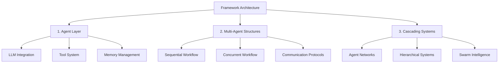

<div align="center">
  <a href="https://swarms.ai">
    
  </a>
</div>

<p align="center">
  <em>The Enterprise-Grade Production-Ready Multi-Agent Orchestration Framework in Rust</em>
</p>

<p align="center">
  <!-- Rust Crate Badges -->
  <a href="https://crates.io/crates/swarms-rs" target="_blank">
    
    
    
  </a>
</p>

<p align="center">
    <a href="https://twitter.com/swarms_corp/">🐦 Twitter</a>
    <span>&nbsp;&nbsp;•&nbsp;&nbsp;</span>
    <a href="https://discord.gg/jM3Z6M9uMq">📢 Discord</a>
    <span>&nbsp;&nbsp;•&nbsp;&nbsp;</span>
    <a href="https://swarms.ai">Swarms Website</a>
    <span>&nbsp;&nbsp;•&nbsp;&nbsp;</span>
    <a href="https://docs.swarms.world">📙 Documentation</a>
    <span>&nbsp;&nbsp;•&nbsp;&nbsp;</span>
    <a href="https://swarms.world">Swarms Marketplace</a>
</p>

<p align="center">
    <!-- Social Media -->
    <a href="https://discord.gg/jHnrkH5y">
        
    </a>
    <a href="https://www.youtube.com/@kyegomez3242">
        
    </a>
    <a href="https://www.linkedin.com/in/kye-g-38759a207/">
        
    </a>
    <a href="https://x.com/kyegomezb">
        
    </a>
</p>

<p align="center">
    <!-- Project Stats -->
    <a href="https://github.com/kyegomez/swarms/issues">
        
    </a>
    <a href="https://github.com/kyegomez/swarms/network">
        
    </a>
    <a href="https://github.com/The-Swarm-Corporation/swarms-rs/stargazers">
        
    </a>
    <a href="https://github.com/The-Swarm-Corporation/swarms-rs/blob/main/LICENSE">
        
    </a>
    <a href="https://star-history.com/#kyegomez/swarms">
        
    </a>
</p>

<p align="center">
    <!-- Share Buttons -->
    <a href="https://twitter.com/intent/tweet?text=Check%20out%20this%20amazing%20AI%20project:%20&url=https%3A%2F%2Fgithub.com%2Fkyegomez%2Fswarms">
        
    </a>
    <a href="https://www.facebook.com/sharer/sharer.php?u=https%3A%2F%2Fgithub.com%2Fkyegomez%2Fswarms">
        
    </a>
    <a href="https://www.linkedin.com/shareArticle?mini=true&url=https%3A%2F%2Fgithub.com%2Fkyegomez%2Fswarms&title=&summary=&source=">
        
    </a>
</p>

<p align="center">
    <!-- Additional Share Buttons -->
    <a href="https://www.reddit.com/submit?url=https%3A%2F%2Fgithub.com%2Fkyegomez%2Fswarms&title=Swarms%20-%20the%20future%20of%20AI">
        
    </a>
    <a href="https://news.ycombinator.com/submitlink?u=https%3A%2F%2Fgithub.com%2Fkyegomez%2Fswarms&t=Swarms%20-%20the%20future%20of%20AI">
        
    </a>
    <a href="https://pinterest.com/pin/create/button/?url=https%3A%2F%2Fgithub.com%2Fkyegomez%2Fswarms&media=https%3A%2F%2Fexample.com%2Fimage.jpg&description=Swarms%20-%20the%20future%20of%20AI">
        
    </a>
    <a href="https://api.whatsapp.com/send?text=Check%20out%20Swarms%20-%20the%20future%20of%20AI%20%23swarms%20%23AI%0A%0Ahttps%3A%2F%2Fgithub.com%2Fkyegomez%2Fswarms">
        
    </a>
</p>

## Overview

`swarms-rs` is an enterprise-grade, production-ready multi-agent orchestration framework built in Rust, designed to handle the most demanding tasks with unparalleled speed and efficiency. Leveraging Rust's bleeding-edge performance and safety features, `swarms-rs` provides a powerful and scalable solution for orchestrating complex multi-agent systems across various industries.

## Key Benefits

| Feature                        | Description                                                                                                                                                                                                 |
|--------------------------------|-------------------------------------------------------------------------------------------------------------------------------------------------------------------------------------------------------------|
| Extreme Performance            | Utilize the full potential of modern multi-core processors with Rust's zero-cost abstractions and fearless concurrency. `Swarms-rs` ensures that your agents run with minimal overhead, achieving maximum throughput and efficiency. |
| Bleeding-Edge Speed            | Written in Rust, `swarms-rs` delivers near-zero latency and lightning-fast execution, making it the ideal choice for high-frequency and real-time applications.                                              |
| Enterprise-Grade Reliability    | Rust's ownership model guarantees memory safety without the need for a garbage collector, ensuring that your multi-agent systems are free from data races and memory leaks.                                   |
| Production-Ready               | Designed for real-world deployment, `swarms-rs` is ready to handle mission-critical tasks with robustness and reliability that you can depend on.                                                           |
| Powerful Orchestration         | Seamlessly manage and coordinate thousands of agents, allowing them to communicate and collaborate efficiently to achieve complex goals.                                                                     |
| Extensible and Modular         | `Swarms-rs` is highly modular, allowing developers to easily extend and customize the framework to suit specific use cases.                                                                                 |
| Scalable and Efficient         | Whether you're orchestrating a handful of agents or scaling up to millions, `swarms-rs` is designed to grow with your needs, maintaining top-tier performance at every level.                               |
| Resource Efficiency             | Maximize the use of system resources with Rust's fine-grained control over memory and processing power, ensuring that your agents run optimally even under heavy loads.                                      |

## Getting Started

### Prerequisites

- Rust (latest stable version recommended)
- Cargo package manager
- An API key for your LLM provider (OpenAI, DeepSeek, etc.)

### Installation

Add `swarms-rs` to your `Cargo.toml`:

```toml
[dependencies]
swarms-rs = "*"
# Or use the latest version from GitHub
swarms-rs = { git = "https://github.com/The-Swarm-Corporation/swarms-rs", branch = "main" }
```

### Environment Setup

Create a `.env` file in your project root with your API credentials:

```
OPENAI_API_KEY=your_openai_key_here
OPENAI_BASE_URL=https://api.openai.com/v1

# Or for DeepSeek
DEEPSEEK_API_KEY=your_deepseek_key_here
DEEPSEEK_BASE_URL=https://api.deepseek.com/v1
```

## Framework Architecture

In swarms-rs, we modularize the framework into three primary architectural stages, each building upon the previous to create increasingly sophisticated agent systems:




1. **Agents (LLM + Tools + Memory)**
   - **Language Models**: Integration with various LLM providers (OpenAI, DeepSeek, etc.)
   - **Tool System**: Extensible framework for adding capabilities through MCP and custom tools
   - **Memory Management**: Short-term and long-term memory systems for maintaining context
   - **State Management**: Handling agent state, configuration, and runtime parameters

2. **Multi-Agent Structures and Communication**
   - **Sequential Workflows**: Linear progression of tasks between multiple agents
   - **Concurrent Workflows**: Parallel execution of tasks across multiple agents
   - **Communication Protocols**: Standardized methods for inter-agent communication
   - **Task Distribution**: Intelligent distribution of workload across agent networks
   - **Synchronization**: Mechanisms for coordinating agent activities and sharing results

3. **Cascading Multi-Agent Systems**
   - **Hierarchical Organizations**: Multi-level agent structures with specialized roles
   - **Swarm Intelligence**: Emergent behavior from large-scale agent interactions
   - **Dynamic Scaling**: Ability to scale agent networks based on workload
   - **Fault Tolerance**: Robust error handling and system recovery
   - **Resource Optimization**: Efficient allocation and utilization of system resources

This modular architecture allows for flexible deployment scenarios, from simple single-agent applications to complex, distributed multi-agent systems. Each layer is designed to be extensible, allowing developers to customize and enhance functionality while maintaining the core benefits of the framework's enterprise-grade reliability and performance.


## Agents

An agent is an entity powered by an LLM equippied with tools and memory that can run autonomously to automate issues. Here's an examp

```rust
use std::env;

use anyhow::Result;
use swarms_rs::{llm::provider::openai::OpenAI, structs::agent::Agent};
use tracing_subscriber::{layer::SubscriberExt, util::SubscriberInitExt};

#[tokio::main]
async fn main() -> Result<()> {
    dotenv::dotenv().ok();
    tracing_subscriber::registry()
        .with(tracing_subscriber::EnvFilter::from_default_env())
        .with(
            tracing_subscriber::fmt::layer()
                .with_line_number(true)
                .with_file(true),
        )
        .init();

    let base_url = env::var("DEEPSEEK_BASE_URL").unwrap();
    let api_key = env::var("DEEPSEEK_API_KEY").unwrap();
        let client = OpenAI::from_url(base_url, api_key).set_model("deepseek-chat");
    let agent = client
        .agent_builder()
        .system_prompt(
            "You are a sophisticated cryptocurrency analysis assistant specialized in:
            1. Technical analysis of crypto markets
            2. Fundamental analysis of blockchain projects
            3. Market sentiment analysis
            4. Risk assessment
            5. Trading patterns recognition
            
            When analyzing cryptocurrencies, always consider:
            - Market capitalization and volume
            - Historical price trends
            - Project fundamentals and technology
            - Recent news and developments
            - Market sentiment indicators
            - Potential risks and opportunities
            
            Provide clear, data-driven insights and always include relevant disclaimers about market volatility."
        )
        .agent_name("CryptoAnalyst")
        .user_name("Trader")
        .enable_autosave()
        .max_loops(3)  // Increased to allow for more thorough analysis
        .save_state_dir("./crypto_analysis/")
        .enable_plan("Break down the crypto analysis into systematic steps:
            1. Gather market data
            2. Analyze technical indicators
            3. Review fundamental factors
            4. Assess market sentiment
            5. Provide comprehensive insights".to_owned())
        .build();
    let response = agent
        .run("What is the meaning of life?".to_owned())
        .await
        .unwrap();
    println!("{response}");
    Ok(())
}

```


### MCP Tool Support

`swarms-rs` supports the Model Context Protocol (MCP), enabling agents to interact with external tools through standardized interfaces. This powerful feature allows your agents to access real-world data and perform actions beyond their language capabilities.

### Supported MCP Server Types

- **STDIO MCP Servers**: Connect to command-line tools that implement the MCP protocol
- **SSE MCP Servers**: Connect to web-based MCP servers using Server-Sent Events

### Example Usage

```rust
// Add a STDIO MCP server
.add_stdio_mcp_server("uvx", ["mcp-hn"])
.await

// Add an SSE MCP server
.add_sse_mcp_server("example-sse-mcp-server", "http://127.0.0.1:8000/sse")
.await
```

----

### Full MCP Agent Example

```rust
use std::env;

use anyhow::Result;
use swarms_rs::{llm::provider::openai::OpenAI, structs::agent::Agent};
use tracing_subscriber::{layer::SubscriberExt, util::SubscriberInitExt};

#[tokio::main]
async fn main() -> Result<()> {
    dotenv::dotenv().ok();
    tracing_subscriber::registry()
        .with(tracing_subscriber::EnvFilter::from_default_env())
        .with(
            tracing_subscriber::fmt::layer()
                .with_line_number(true)
                .with_file(true),
        )
        .init();

    let base_url = env::var("DEEPSEEK_BASE_URL").unwrap();
    let api_key = env::var("DEEPSEEK_API_KEY").unwrap();
    let client = OpenAI::from_url(base_url, api_key).set_model("deepseek-chat");
    let agent = client
        .agent_builder()
        .system_prompt("You are a helpful assistant.")
        .agent_name("SwarmsAgent")
        .user_name("User")
        // How to install uv: https://github.com/astral-sh/uv#installation
        // mcp stdio server, any other stdio mcp server can be used
        .add_stdio_mcp_server("uvx", ["mcp-hn"])
        .await
        // mcp sse server, we can use mcp-proxy to proxy the stdio mcp server(which does not support sse mode) to sse server
        // run in console: uvx mcp-proxy --sse-port=8000 -- npx -y @modelcontextprotocol/server-filesystem ~
        // this will start a sse server on port 8000, and ~ will be the only allowed directory to access
        .add_sse_mcp_server("example-sse-mcp-server", "http://127.0.0.1:8000/sse")
        .await
        .retry_attempts(1)
        .max_loops(1)
        .build();

    let response = agent
        .run("Get the top 3 stories of today".to_owned())
        .await
        .unwrap();
    // mcp-hn stdio server is called and give us the response
    println!("STDIO MCP RESPONSE:\n{response}");

    let response = agent.run("List ~ directory".to_owned()).await.unwrap();
    // example-sse-mcp-server is called and give us the response
    println!("SSE MCP RESPONSE:\n{response}");

    Ok(())
}
```


See the [mcp_tool.rs](swarms-rs/examples/mcp_tool.rs) example for a complete implementation.


## Run Examples

In [swarms-rs/examples](swarms-rs/examples/) there is our sample code, which can provide a considerable degree of reference:

To run the graph workflow example:

```bash
cargo run --example graph_workflow
```

`DEEPSEEK_API_KEY` and `DEEPSEEK_BASE_URL` environment variables are read by default.

----

## Architecture

`swarms-rs` is built with a modular architecture that allows for easy extension and customization:

- **Agent Layer**: Core agent implementation with memory management and tool integration
- **LLM Provider Layer**: Abstraction for different LLM providers (OpenAI, DeepSeek, etc.)
- **Tool System**: Extensible tool framework for adding capabilities to agents
- **MCP Integration**: Support for Model Context Protocol tools via STDIO and SSE interfaces
- **Swarm Orchestration**: Coordination of multiple agents for complex workflows
- **Persistence Layer**: State management and recovery mechanisms

### Development Setup

1. Clone the repository:

   ```bash
   git clone https://github.com/The-Swarm-Corporation/swarms-rs
   cd swarms-rs
   ```

2. Install development dependencies:

   ```bash
   cargo install cargo-nextest
   ```

3. Run tests:

   ```bash
   cargo nextest run
   ```

4. Run benchmarks:

   ```bash
   cargo bench
   ```

## License

This project is licensed under the MIT License - see the [LICENSE](LICENSE) file for details.

## Contact

For questions, suggestions, or feedback, please open an issue or contact us at [kye@swarms.world](mailto:kye@swarms.world).
